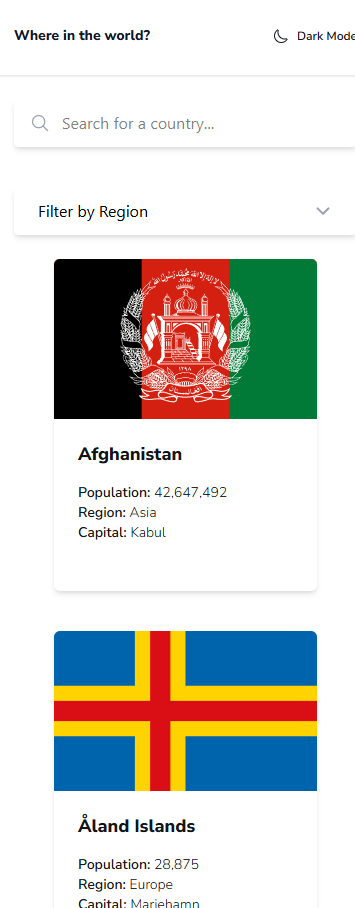
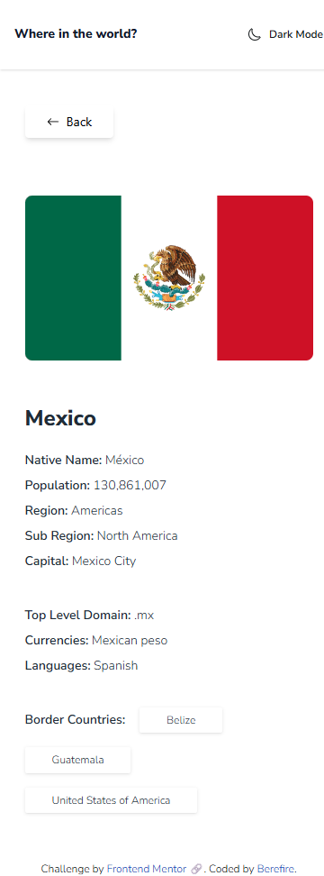
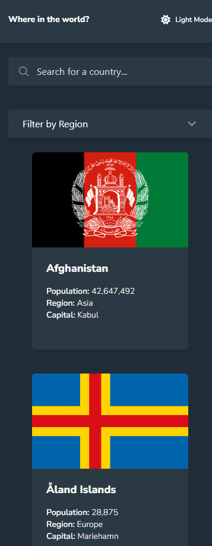
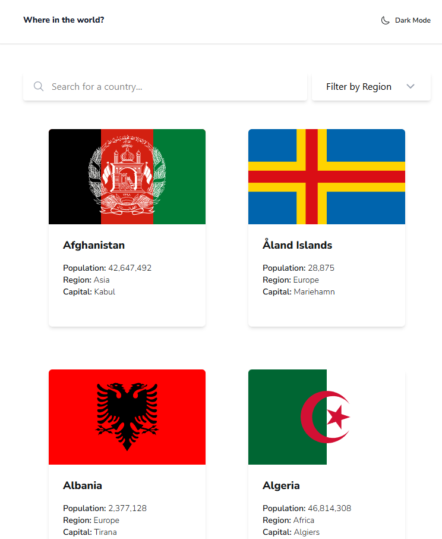
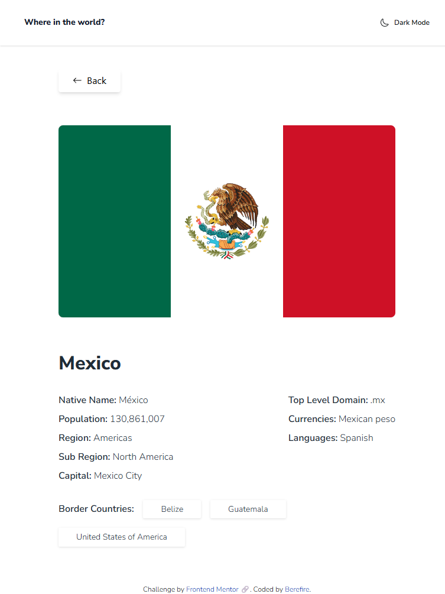
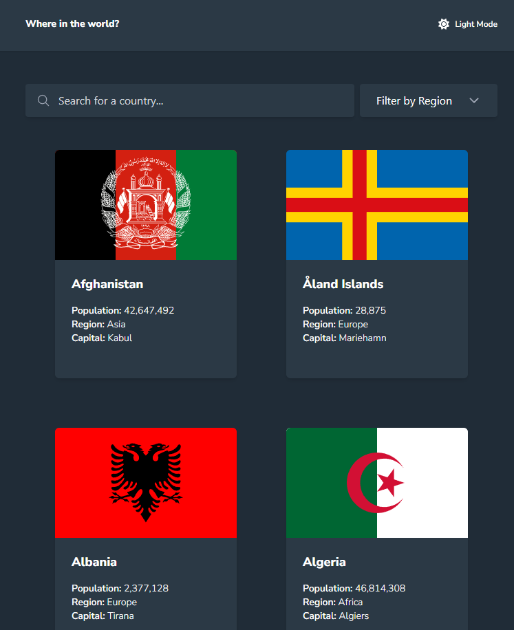
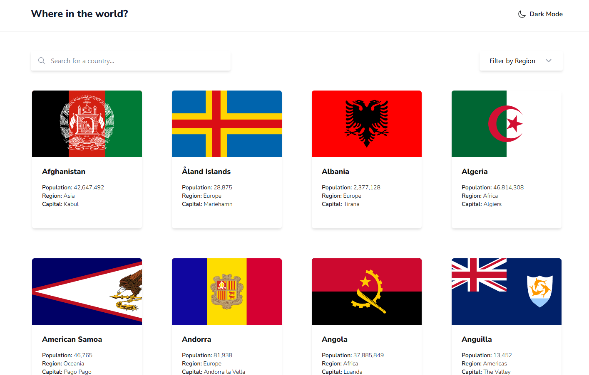
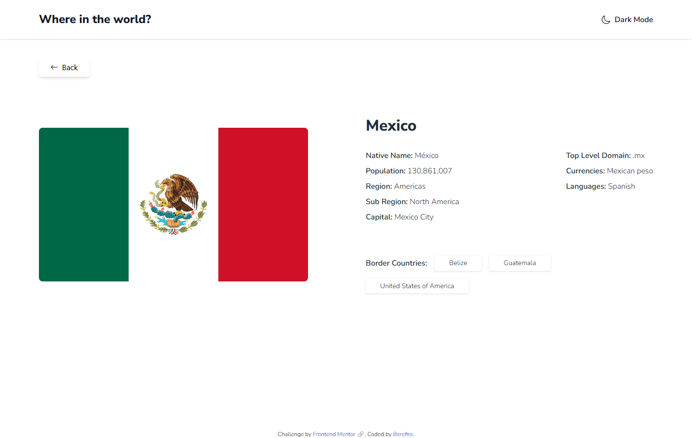
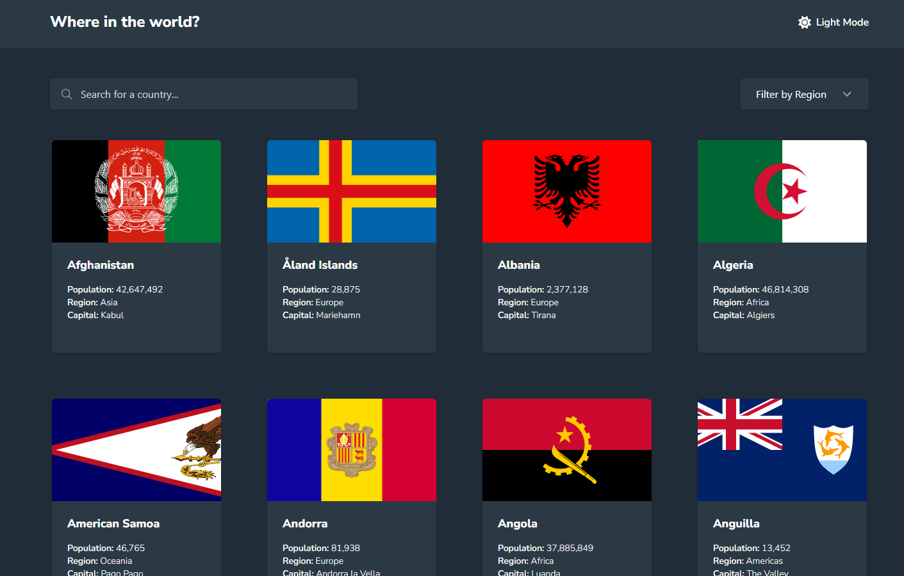

# Frontend Mentor - REST Countries API with color theme switcher solution


[](https://www.frontendmentor.io/)


This is a solution to the [REST Countries API with color theme switcher challenge on Frontend Mentor](https://www.frontendmentor.io/challenges/rest-countries-api-with-color-theme-switcher-5cacc469fec04111f7b848ca). Frontend Mentor challenges help you improve your coding skills by building realistic projects.

---

## Table of contents

- [Overview](#overview)
  - [The challenge](#the-challenge)
  - [Screenshot](#screenshot)
  - [Links](#links)
- [My process](#️my-process)
  - [Built with](#built-with)
  - [What I learned](#what-i-learned)
  - [Continued development](#continued-development)
  - [Useful resources](#useful-resources)
  - [AI Collaboration](#ai-collaboration)
- [Author](#author)
- [Acknowledgments](#acknowledgments)

---

## 📖Overview

### The challenge

Users should be able to:

- See all countries from the data on the homepage
- Search for a country using an `input` field
- Filter countries by region
- Click on a country to see more detailed information on a separate page
- Click through to the border countries on the detail page
- Toggle the color scheme between light and dark mode

### 📸Screenshot

#### Mobile

| _Home_ | _Country detail_ | _Dark mode_ |
| ------ | ------ | -------- |
|  |  |  |

#### Tablet

| _Home_ | _Country detail_ | _Dark mode_ |
| ------ | ------ | -------- |
|  |  |  |

#### Desktop

| _Home_ | _Country detail_ | _Dark mode_ |
| ------ | ------ | -------- |
|  |  |  |

---

### 🔗Links

- Solution URL: [https://www.frontendmentor.io/solutions/rest-countries-api-app-with-search-filters-and-a-dark-theme-xhppCW2UWi](https://www.frontendmentor.io/solutions/rest-countries-api-app-with-search-filters-and-a-dark-theme-xhppCW2UWi)
- Live Site URL: [https://berefire.github.io/rest-countries-api-with-color-theme-switcher/](https://berefire.github.io/rest-countries-api-with-color-theme-switcher/)

---

## ⚙️My process

### Built with

- [React](https://react.dev/) - JS library for building the UI as small, composable components
- [Vite](https://vitejs.dev/) - build tool and dev server
- [React Router](https://reactrouter.com/) - client-side routing between the country list and country detail pages
- [Tailwind CSS v4](https://tailwindcss.com/) - utility-first styling via the `@tailwindcss/vite` plugin, with a custom `dark` variant for class-based dark mode
- [Storybook](https://storybook.js.org/) - for developing and testing components in isolation, with Vitest browser-mode interaction tests
- React Context API - for the light/dark theme, persisted to `localStorage` and initialized from the user's OS-level color scheme preference
- A local `data.json` dataset rather than a live API call, since the original free REST Countries v3.1 endpoint has since been deprecated
- A custom accessible dropdown (button + listbox, `aria-activedescendant`, arrow-key navigation) for the region filter, built from scratch rather than styling a native `<select>`
- Semantic HTML - single `<h1>` per page via the header's site title, `<article>` for the country detail page, real `<label>` elements (visually hidden where needed) for the search input
- Mobile-first responsive workflow
- Conventional Commits for commit message structure

---

### 💡What I learned

**A native `<select>` can't be visually restyled beyond a certain point - matching an exact dropdown design means rebuilding it from scratch.** Browsers render a `<select>`'s open list themselves, with no CSS control over its spacing, corners, or shadow. Getting the floating panel look the design called for meant replacing it entirely with a button + custom listbox, reimplementing the accessibility a native select gives away for free - `aria-haspopup`, `aria-expanded`, `aria-activedescendant` for virtual focus, and arrow-key/Enter/Escape handling:

```js
    <button
      aria-haspopup="listbox"
      aria-expanded={isOpen}
      aria-activedescendant={activeOptionId}
      aria-label={`Filter by region: ${region || "All"}`}
      onKeyDown={handleTriggerKeyDown}
    >
      {region || "Filter by Region"}
    </button>
```

**A custom dropdown's `onClick` can silently never fire, because of event ordering.** Clicking an option in the custom listbox shifted focus away from the trigger button, which fired the wrapper's `onBlur`, which closed the dropdown - unmounting the option - before the browser's `click` event ever reached it. The fix is preventing the focus shift in the first place, on `mousedown`, not `click`:

```js
    <li onMouseDown={(e) => e.preventDefault()} onClick={() => selectRegion(value)}>
```

**A mistyped Tailwind class fails completely silently.** Two separate typos cost real debugging time for the same underlying reason: `w-fullps-6` (a missing space collapsing two utilities into one meaningless token) and `pbs-6` (not a real Tailwind utility at all) both compiled to nothing, with no error - just missing width, padding, or spacing with no clue why. Unlike a JS typo, an invalid Tailwind class doesn't throw; it just quietly does nothing.

**`toLocaleString()` without an explicit locale follows the visitor's own browser settings, not a fixed format.** Population numbers were rendering with a period as the thousands separator instead of a comma on some machines, because the browser's locale (not the app) decides that formatting by default. Forcing a locale fixes it for every visitor consistently:

```js
    population.toLocaleString("en-US")
```

**Deploying to a GitHub Pages subpath breaks routing unless React Router is told about it explicitly.** Once Vite's `base` config was set for the project's GitHub Pages URL, the dev server started serving everything under `/rest-countries-api-with-color-theme-switcher/` - but `BrowserRouter` still assumed routes lived at the domain root, producing "No routes matched." Passing Vite's own base path straight into `basename` fixed it, and keeps the two in sync automatically if the path ever changes:

```js
    <BrowserRouter basename={import.meta.env.BASE_URL}>
```

**`aria-hidden="true"` can never sit on an element that can receive keyboard focus.** A reusable `Button` component had `aria-hidden="true"` applied to the actual `<button>` itself (meant for a decorative icon inside it), which hides the button - and anything inside it - from every screen reader, sitewide. Chrome actually catches this at runtime and blocks it, logging "Blocked aria-hidden on an element because its descendant retained focus," since an element can't be both hidden from assistive tech and currently focused at the same time.

---

### 🚀Continued development

- **Deepen React Router usage** – extend beyond the current list → detail navigation with nested routes, per-route loading/error states, and graceful handling of an invalid country slug instead of a blank page.
- **Expand the Context API pattern** – as the app grows (e.g. if search/filter state is added), practice splitting concerns into separate contexts rather than one large one, and get more comfortable with when Context stops being the right tool versus a lighter state library like Zustand.
- **Add search and filtering** – search by country name, filter by region, and sort by population or alphabetically. Good practice for combining URL query params with existing Context state.
- **Accessibility pass** – keyboard navigation through the country grid, focus management on navigation to a detail page, and re-checking color contrast in both themes now that the animated toggle is in place.
- **Testing** – extend the existing Storybook setup with interaction tests (or add React Testing Library) for the theme toggle and card hover states.
- **More animation polish** – apply the same View Transitions API technique already used for the theme toggle to route transitions (list → detail page) for a more cohesive feel.

---

### 📚Useful resources

- [ARIA Authoring Practices Guide - Listbox pattern](https://www.w3.org/WAI/ARIA/apg/patterns/listbox/) - Reference for the `aria-activedescendant` approach used to keep DOM focus on the trigger button while virtually highlighting options.
- [WAI-ARIA - aria-hidden](https://w3c.github.io/aria/#aria-hidden) - Clarified why an element can't be both focused and `aria-hidden` at the same time.
- [MDN - Intl.NumberFormat](https://developer.mozilla.org/en-US/docs/Web/JavaScript/Reference/Global_Objects/Intl/NumberFormat) - Background on how `toLocaleString()`'s formatting depends on the active locale.
- [Vite - env variables and modes](https://vitejs.dev/guide/env-and-mode.html) - Confirmed `import.meta.env.BASE_URL` always mirrors the configured `base`, for keeping React Router's `basename` in sync.
- [Testing Library - Role queries](https://testing-library.com/docs/queries/byrole/) - Used to query the custom listbox's `role="option"` elements in Storybook interaction tests.

---

### 🤖AI Collaboration

I used Claude throughout this project as a pair-programming partner rather than having it write the project for me: I wrote and applied the code myself, and Claude explained concepts, reviewed my components for accessibility and correctness, and proposed code for me to review and apply when I asked directly.

- **What worked well:** pasting actual screenshots alongside the exact source code made the difference on several visual bugs - the region dropdown's text wrapping and the missing left padding were both diagnosed precisely because the rendered result and the code were compared side by side, rather than guessing from a description. The same was true for the filter-not-updating bug, which turned out to be an event-ordering race condition that wouldn't have been obvious from the code alone.
- **What didn't work as well at first:** matching the custom region dropdown to an exact visual design took several rounds - a native `<select>` couldn't achieve the look at all, and once rebuilt as a custom listbox, it needed a follow-up fix for text wrapping, another for a fixed-width/max-width conflict, and another for the focus-blur race condition, before it was fully working and accessible.

---

## 👤Author

- Frontend Mentor - [@berefire](https://www.frontendmentor.io/profile/berefire)
- GitHub - [@berefire](https://github.com/berefire)

---

## 🙏Acknowledgments

Thanks to Frontend Mentor for the challenge brief, and to Claude for the pair-programming support and code reviews.

---
